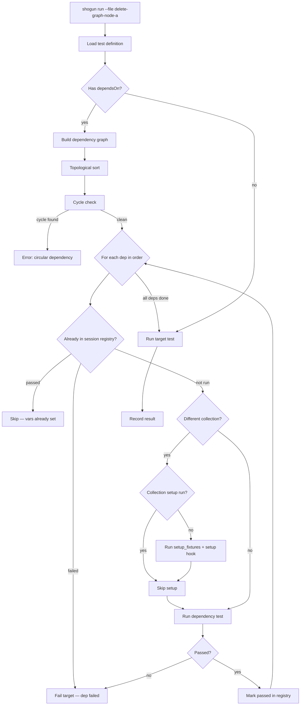

# Shogun — `dependsOn` + Shared Setup Fixtures

> Status: Design Draft — 2026-04-11  
> Author: Architect session

---

## Problem Statement

Shogun tests today have **implicit, untracked dependencies**. When `delete-graph-node-a` needs `create-graph-node-a` to have run first, this dependency is expressed only as a runtime `ctx.assert()` explosion — not as a declared relationship the engine can reason about. This creates two concrete failure modes:

1. **Running a single test cold** — `shogun run --file delete-graph-node-a.yaml` will fail with a confusing assertion error because neither the collection `setup` ran (no `testNodePathA`) nor the create test ran (no `createdNodePathA`). There is no way for the runner to figure out _what to run first_.

2. **Re-running failures is incomplete** — the `_failures_` collection replays test files, but cannot reconstitute the pre-conditions those tests depended on.

Additionally, **collection setup code is copy-pasted**. The workspace-load block in `graph/_collection.yaml` is verbatim identical to the one in `code/_collection.yaml` — a maintenance liability that will diverge over time.

---

## Goals

1. Tests and collections can **declare** their dependencies — other tests or named setup fixtures
2. The runner can **automatically satisfy** those dependencies before executing the target test
3. A **shared fixture system** replaces duplicated setup scripts across collections
4. No dependency is ever run more than once per session
5. Circular dependencies are detected at load time with a clear error
6. All of this is **additive** — existing tests with no `dependsOn` continue to work unchanged

---

## Story 1 — Test-Level `dependsOn`

**As a test author**, I want to declare that `delete-graph-node-a` depends on `create-graph-node-a`, so that when I run the delete test in isolation, the engine automatically runs the create test first (including its collection's setup hooks), sets up `ctx.vars`, and then runs my test.

### YAML Shape

```yaml
# tests/collections/graph/delete-graph-node-a.yaml

name: Delete Graph Node A
dependsOn:
  - graph/create-graph-node-a       # cross-collection ref (collection/test-name)
  - graph/create-graph-node-b       # multiple deps are fine; run in declared order
```

Local refs (within same collection) are also valid:
```yaml
dependsOn:
  - create-graph-node-a             # no slash = same collection as this test
```

### Engine Behavior

When the runner is asked to execute a test with `dependsOn`:

```
1. Build a dependency graph for the target test (recursive)
2. Detect cycles — error at load time, never at runtime
3. Compute a topological execution order
4. For each dependency, in order:
   a. Check session registry — if already executed (passed), skip (vars already live)
   b. If not yet executed:
      - If it's in a different collection, run that collection's setup hook first
        (once per collection per session, same deduplication)
      - Run the dependency test
      - If it fails, abort — the dependent test gets status=failed with a clear
        "Dependency 'graph/create-graph-node-a' failed" message
5. Run the target test with full ctx.vars populated from dependency chain
```

### Session Registry

A new `SessionRegistry` (plain `Map<string, 'pending' | 'running' | 'passed' | 'failed'>`) is maintained for the duration of a run. Keys are canonical test IDs in the form `collection/test-name`.

- Already-passed entries → skip, move on
- Already-failed entries → propagate failure to dependent immediately
- `running` state → cycle detection (should not be reachable after load-time check)

### Collection Setup Deduplication

When a dependency is in a different collection, the runner must run that collection's `setup` hook before the first test from that collection executes in the session. A separate `Set<string>` tracks which collections have had their setup run. Teardown hooks for injected collections run at the end of the overall run (after all tests), in reverse dependency order.

### Acceptance Criteria

- `shogun run --file tests/collections/graph/delete-graph-node-a.yaml` automatically runs `create-graph-node-a` first
- `shogun run --collection graph` behaves identically to today (deps already satisfied by ordering)
- Cycle `A → B → A` is detected at load time: `Error: Circular dependency detected: graph/test-a → graph/test-b → graph/test-a`
- A dependency failure produces: `Skipping 'Delete Graph Node A' — dependency 'graph/create-graph-node-a' failed`
- The session registry prevents any test from running more than once

---

## Story 2 — Collection-Level `dependsOn`

**As a test author**, I want to declare that the `graph` collection depends on the `workspace` collection having run its setup, so I don't have to duplicate workspace-load logic.

### YAML Shape

```yaml
# tests/collections/graph/_collection.yaml

name: Graph API
dependsOn:
  - collections/workspace           # another collection's full lifecycle
```

### Engine Behavior

When loading a collection that declares `dependsOn`:
- Each referenced collection's `setup` hook runs before this collection's setup
- The dependency collection's teardown runs after this collection's teardown
- Already-initialized collections are skipped (same session deduplication)

This is the coarse-grained version of Story 1's cross-collection dep hoisting.

### Acceptance Criteria

- `shogun run --collection graph` automatically runs `workspace` collection setup first
- `shogun run` (all collections) does not double-run workspace setup even if both `graph` and `code` depend on it

---

## Story 3 — Shared Setup Fixtures

**As a test author**, I want to define reusable named setup scripts (not full tests) that multiple collections can reference, eliminating copy-paste.

### The Problem (Concrete)

Both `graph/_collection.yaml` and `code/_collection.yaml` contain:

```javascript
// Workspace load — identical in both files
const wsName = (ctx.env.WORKSPACE_NAME ?? '').trim();
if (!wsName) {
  ctx.log('WARNING: WORKSPACE_NAME not set...');
} else {
  const res = await ctx.http.post(`/api/workspace/load/${wsName}`, null);
  ...
}
```

This will diverge. It already is a problem.

### Solution — `tests/fixtures/` Directory

Introduce a `tests/fixtures/` directory (not to be confused with JSON body fixtures, which stay in `tests/fixtures/` under the old meaning — we'll use `tests/setup-fixtures/` to be explicit, or a dedicated top-level `fixtures/` path in config).

**Config addition** (`shogun.config.yaml`):
```yaml
paths:
  setup_fixtures: ./tests/setup-fixtures   # new; optional, defaults shown
```

**Fixture file format:**
```yaml
# tests/setup-fixtures/workspace-load.yaml

name: workspace-load
description: >
  Loads the WORKSPACE_NAME from env into the active context.
  Safe to call multiple times — subsequent calls are no-ops if already loaded.

script: |
  const wsName = (ctx.env.WORKSPACE_NAME ?? '').trim();
  if (!wsName) {
    ctx.log('WARNING: WORKSPACE_NAME not set — skipping workspace load.');
    ctx.vars.workspaceName = null;
  } else {
    // Idempotency guard — don't reload if already done this session
    if (ctx.vars._fixtureLoaded_workspace) {
      ctx.log(`Workspace already loaded: ${ctx.vars.workspaceName}`);
      return;
    }
    ctx.log(`Loading workspace: "${wsName}"`);
    const res = await ctx.http.post(`/api/workspace/load/${wsName}`, null);
    ctx.vars.workspaceName = wsName;
    ctx.vars._fixtureLoaded_workspace = true;
    ctx.log(`Workspace load response: ${res.status}`);
  }
```

**Collection setup referencing a fixture:**
```yaml
# tests/collections/graph/_collection.yaml

name: Graph API
setup_fixtures:
  - workspace-load     # name of file in tests/setup-fixtures/
  - auth               # another fixture — runs in declared order

setup: |
  # This runs AFTER fixtures. Only graph-specific state goes here.
  const ts = Date.now();
  ctx.vars.testNodePathA = `run-${ts}/node-a`;
  ctx.vars.testNodePathB = `run-${ts}/node-b`;
  ctx.vars.createdNodePathA = null;
  ctx.vars.createdNodePathB = null;
  ctx.vars.createdLinkId    = null;
```

### Fixture Execution Order

Per collection setup:
```
1. Run setup_fixtures[] in order (each is a script, no request)
2. Run collection's own setup: script
3. Run tests
4. Run collection's own teardown: script
5. (no fixture teardown — fixtures are stateless setup scripts by design)
```

### Fixture Idempotency Convention

Fixtures should be **idempotent** by convention, guarded by a `ctx.vars._fixtureLoaded_{name}` flag. The engine does **not** enforce this mechanically — it's a documentation-level contract. This keeps the fixture system simple.

### Acceptance Criteria

- `workspace-load.yaml` fixture exists and is referenced by both `graph` and `code` collections
- Both collections' `setup:` scripts no longer contain workspace-load logic
- Running either collection produces identical behavior to today
- `shogun lint` validates that referenced fixture files exist
- A missing fixture file throws at load time: `Setup fixture not found: workspace-load`

---

## Technical Design

### Changes to `src/types.ts`

```typescript
// TestDefinition — add dependsOn
export interface TestDefinition {
  name: string;
  dependsOn?: string[];        // NEW — list of "collection/test-name" or "test-name" refs
  // ... rest unchanged
}

// CollectionDefinition — add dependsOn + setup_fixtures
export interface CollectionDefinition {
  name: string;
  dependsOn?: string[];        // NEW — list of "collections/name" refs
  setup_fixtures?: string[];   // NEW — list of fixture names
  // ... rest unchanged
}

// New: SetupFixture
export interface SetupFixtureDefinition {
  name: string;
  description?: string;
  script: string;              // TypeScript source, same ctx as collection setup
}

// New: session state
export interface SessionState {
  testsRun: Map<string, 'passed' | 'failed'>;       // canonical "collection/test" → result
  collectionsSetup: Set<string>;                     // collections whose setup has run
  fixturesRun: Set<string>;                          // fixture names already executed this session
}
```

### Changes to `src/loader.ts`

- Add `loadSetupFixture(name, config, cwd)` — loads from `tests/setup-fixtures/`
- Add `dependsOn` and `setup_fixtures` to Zod schemas for both `TestDefinitionSchema` and `CollectionDefSchema`
- Add `buildDependencyGraph(testId, allTests, config, cwd)` → topologically sorted list
- Add cycle detection: DFS with `visiting` + `visited` sets

### Changes to `src/runner.ts`

- Instantiate `SessionState` at start of run
- New `resolveAndRunTest(testId, sessionState, opts)` — handles dep resolution recursively
- `runTests()` → for each test in plan: call `resolveAndRunTest()` (deps deduplicated by session registry)
- Collection setup: run `setup_fixtures` scripts before `setup:` script
- Collection teardown ordering: reverse topological order of setup

### Changes to `src/commands/lint.ts`

- Validate `dependsOn` references exist as actual test files
- Validate `setup_fixtures` references exist as fixture files
- Detect cycles and report them

---

## Execution Flow Diagram



---

## What Stays the Same

- The `order:` field in `_collection.yaml` continues to work exactly as today
- Tests without `dependsOn` are completely unaffected
- The `ctx.vars` stashing pattern (`ctx.vars.createdNodePathA = ...`) is unchanged
- The `ctx.assert()` guards in pre-scripts remain valid as belt-and-suspenders checks
- `_failures_` collection continues to work; with deps declared, re-running failures will now auto-resolve pre-conditions

---

## What We're NOT Doing (Scope Limits)

- No parallel execution of independent dependency branches (future)
- No automatic teardown of dependency-injected state (caller is responsible)
- Fixture teardown hooks (fixtures are setup-only; teardown stays in collection teardown)
- Dependency visualization UI (useful future feature — `shogun deps --test graph/delete-graph-node-a`)

---

## Migration Path for Existing Collections

1. Create `tests/setup-fixtures/workspace-load.yaml` with the extracted shared script
2. Add `setup_fixtures: [workspace-load]` to `graph/_collection.yaml` and `code/_collection.yaml`
3. Remove the workspace-load block from both collection `setup:` scripts
4. Add `dependsOn:` to delete/modify tests that rely on create tests having run first
5. Run `shogun lint` to validate the graph is clean

This migration is **non-breaking** — all old-style collections without these new fields work identically.

---

## Open Questions for Review

1. **Fixture teardown?** Should fixtures optionally declare a `teardown_script`? Current proposal says no — keep fixtures stateless. Collections own teardown. Agree?

2. **Fixture location naming** — `tests/setup-fixtures/` vs `fixtures/` vs `tests/fixtures/setup/`? The current repo uses `tests/fixtures/` for JSON body files, so we need to distinguish. Proposal: `tests/setup-fixtures/` (explicit) or a `setup_fixtures/` top-level dir alongside `tests/`.

3. **`dependsOn` on collection cross-deps (`Story 2`)** — Is this necessary for v1 of this feature, or is Story 3 (shared fixtures) sufficient to solve the workspace-load duplication? Story 2 is more powerful but more complex. We could ship Story 1 + Story 3 first.

4. **Failure propagation depth** — If A→B→C and C fails, should B and A both show `status: dependency_failed` in the run summary? Or just A? Proposal: all intermediate dependents get `status: dependency_failed` so the summary accurately reflects impact.
