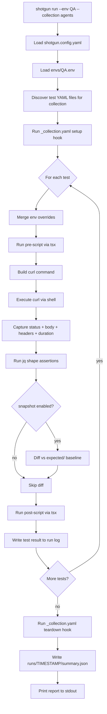

# Shotgun — API Testing System Architecture

> Continuation of: [`docs/iniital-research.md`](../iniital-research.md)
> Status: Design Draft v0.1 — 2026-03-29

---

## 1. Philosophy

Shotgun is a **shell-first, TypeScript-enhanced** API testing system.

The design layers are:

| Layer | Tech | Purpose |
|-------|------|---------|
| Shell | bash, curl, jq, diff | HTTP execution, file ops, diffs, piping |
| Orchestration | TypeScript (tsx) | YAML parsing, test lifecycle, logging, reporting |
| Scripting | TypeScript (inline or file) | Pre/post hooks, assertions, variable extraction |
| Config | YAML | Test definitions, collections, global config |
| Environment | `.env` files | Per-environment variable sets |

The goal: use UNIX tools as far as they take us, and only bring in TypeScript where logic, scripting, or programmability are genuinely needed.

---

## 2. Folder Structure

```
shotgun/
├── src/                          # TypeScript orchestration engine
│   ├── index.ts                  # CLI entrypoint
│   ├── runner.ts                 # Test runner loop
│   ├── loader.ts                 # YAML + env file loader
│   ├── executor.ts               # curl invocation + response capture
│   ├── asserter.ts               # shape checks, snapshot diffs, status
│   ├── scripter.ts               # runs inline TS pre/post scripts
│   ├── logger.ts                 # run log writer
│   ├── reporter.ts               # summary / report rendering
│   └── types.ts                  # shared types / interfaces
│
├── tests/                        # Test definition YAML files
│   ├── collections/
│   │   ├── agents/
│   │   │   ├── _collection.yaml  # collection-level metadata + hooks
│   │   │   ├── get-agents.yaml
│   │   │   ├── create-agent.yaml
│   │   │   └── get-agent-by-name.yaml
│   │   └── system/
│   │       ├── _collection.yaml
│   │       └── health.yaml
│   └── suites/                   # Named multi-collection suites
│       └── smoke.yaml
│
├── envs/                         # Environment variable files
│   ├── local.env
│   ├── QA.env
│   ├── QA-2.env
│   └── staging.env
│
├── expected/                     # Snapshot baselines (committed)
│   └── agents/
│       ├── GET_api_agents.json
│       └── GET_api_agents_name.json
│
├── runs/                         # Generated run logs (gitignored)
│   └── 2026-03-28_20-00-00/
│       ├── summary.json
│       └── agents--GET_api_agents.log
│
├── scripts/                      # Shared TypeScript helpers (importable in pre/post)
│   ├── auth.ts                   # Token helpers
│   └── transforms.ts             # Body transformers
│
├── shotgun.config.yaml            # Global config
├── package.json
└── tsconfig.json
```

---

## 3. Environment Files

Environment files use standard `.env` format (key=value, `#` comments). They are loaded via the shell and also made available to the TypeScript context.

```bash
# envs/QA.env
BASE_URL=https://qa.myapi.com
AUTH_TOKEN=Bearer eyJhbGc...
AGENT_NAME=qa-test-agent
TIMEOUT=10
```

**Selection:**
```bash
shotgun run --env QA          # loads envs/QA.env
shotgun run --env QA-2        # loads envs/QA-2.env
shotgun run                   # defaults to envs/local.env
```

Variables are available in YAML test files as `${VAR_NAME}` interpolation and in the TypeScript context as `ctx.env.VAR_NAME`.

---

## 4. Global Config (`shotgun.config.yaml`)

```yaml
version: 1

defaults:
  env: local
  timeout: 10
  follow_redirects: true
  content_type: application/json

paths:
  tests: ./tests
  envs: ./envs
  expected: ./expected
  runs: ./runs
  scripts: ./scripts

ignore_fields_global:
  - "**.timestamp"
  - "**.createdAt"
  - "**.updatedAt"
  - "**.requestId"

reporting:
  format: pretty         # pretty | json | tap
  on_fail: diff          # diff | body | silent
```

---

## 5. Test Definition File (YAML)

This is the core artifact. Each `.yaml` file defines one or more test cases.

```yaml
# tests/collections/agents/get-agents.yaml

name: "Get All Agents"
description: "Validates the agents list endpoint"
collection: agents
tags:
  - smoke
  - agents
  - readonly

# Optional: per-test env overrides (merged on top of loaded .env)
env:
  AGENT_NAME: test-agent-alpha

# Optional: pre-request script (TypeScript)
# Runs before curl. Can mutate ctx.request and ctx.env.
pre: |
  // Refresh auth token before request
  const token = await scripts.auth.getToken(ctx.env);
  ctx.request.headers['Authorization'] = `Bearer ${token}`;

request:
  method: GET
  path: /api/agents
  headers:
    Accept: application/json
  params:                      # query string params
    limit: 10
    offset: 0
  # body: only for POST/PUT/PATCH
  # body:
  #   file: ./fixtures/create-agent.json   # external file reference
  #   inline:                              # or inline
  #     name: "${AGENT_NAME}"
  #     config: {}

response:
  status: 200                  # assert HTTP status code

  snapshot: true               # compare against expected/ baseline
  ignore_fields:               # strip these paths before snapshot diff
    - "**.id"
    - "**.timestamp"

  shape:                       # jq-based assertions (shell layer)
    - ".agents | type == \"array\""
    - ".agents | length >= 0"
    - "has(\"total\")"

# Optional: post-response script (TypeScript)
# Full access to request + response. Throw or call assert() to fail.
post: |
  assert(ctx.response.status === 200, "Expected HTTP 200");
  assert(Array.isArray(ctx.response.body.agents), "agents must be array");
  // Stash for chained tests
  if (ctx.response.body.agents.length > 0) {
    ctx.vars.firstAgentName = ctx.response.body.agents[0].name;
  }
```

---

## 6. Collection File (`_collection.yaml`)

Collections group related tests and can define shared setup/teardown.

```yaml
# tests/collections/agents/_collection.yaml

name: Agents API
description: All endpoints under /api/agents
order:
  - get-agents
  - create-agent
  - get-agent-by-name

# Runs once before all tests in this collection
setup: |
  ctx.vars.testAgentName = `shotgun-${Date.now()}`;
  ctx.log(`Will use agent name: ${ctx.vars.testAgentName}`);

# Runs once after all tests in this collection
teardown: |
  if (ctx.vars.createdAgentName) {
    ctx.log(`Cleaning up agent: ${ctx.vars.createdAgentName}`);
    // teardown can trigger HTTP calls via ctx.http()
    await ctx.http.delete(`/api/agents/${ctx.vars.createdAgentName}`);
  }
```

---

## 7. Suite File

Suites are named groupings of collections for running subsets.

```yaml
# tests/suites/smoke.yaml

name: Smoke Suite
description: Quick health check — GETs only
collections:
  - agents
  - system
tags:
  - smoke
```

---

## 8. TypeScript Scripting Context

Every pre/post script receives a `ShotgunContext` object:

```typescript
// src/types.ts

export interface ShotgunContext {
  // Loaded env vars (merged: global + .env file + test-level overrides)
  env: Record<string, string>;

  // Cross-test variable store (writable, persists across tests in a run)
  vars: Record<string, unknown>;

  // Current request (mutable in pre-script)
  request: {
    method: string;
    url: string;
    headers: Record<string, string>;
    params: Record<string, string>;
    body?: unknown;
  };

  // Current response (populated after curl; available in post-script)
  response: {
    status: number;
    headers: Record<string, string>;
    body: unknown;           // parsed JSON or raw string
    raw: string;             // raw response body
    duration: number;        // ms
  };

  // Assertion helper — throws ShotgunAssertionError on failure
  assert(condition: boolean, message: string): void;

  // Log to run log (shows in output and written to run log file)
  log(message: string): void;

  // Make additional HTTP calls (for setup/teardown/chaining)
  http: {
    get(path: string, opts?: RequestOpts): Promise<ShotgunResponse>;
    post(path: string, body: unknown, opts?: RequestOpts): Promise<ShotgunResponse>;
    delete(path: string, opts?: RequestOpts): Promise<ShotgunResponse>;
  };

  // Access shared scripts from scripts/ directory
  scripts: Record<string, unknown>;
}
```

Pre/post scripts are transpiled and executed in a sandboxed Node.js context with `tsx`. They support `async/await`. The context object is injected; no imports are needed for core features.

---

## 9. Execution Flow



---

## 10. Shell Layer — curl Invocation

The shell layer remains pure bash + curl + jq. The TypeScript orchestrator constructs and calls this:

```bash
#!/usr/bin/env bash
# executor.sh — called by TypeScript executor.ts via child_process

METHOD="$1"
URL="$2"
HEADERS_FILE="$3"      # temp file with headers (one per line: "Key: Value")
BODY_FILE="$4"         # optional request body file
OUT_BODY="$5"          # output file for response body
OUT_META="$6"          # output file for status + duration JSON

curl -s \
  -X "$METHOD" \
  -H @"$HEADERS_FILE" \
  ${BODY_FILE:+--data-binary @"$BODY_FILE"} \
  -o "$OUT_BODY" \
  -w '{"status":%{http_code},"duration":%{time_total},"content_type":"%{content_type}"}' \
  "$URL" > "$OUT_META"
```

This keeps curl native and avoids any HTTP library overhead in Node.

---

## 11. Snapshot / Baseline Management

```bash
# Capture new baselines (first run or intentional update)
shotgun snapshot --env QA --collection agents

# Compare only (no baseline update)
shotgun run --env QA

# Update specific test baseline
shotgun snapshot --file tests/collections/agents/get-agents.yaml
```

Baselines live in `expected/` keyed by collection + sanitized path:
```
expected/agents/GET_api_agents.json
expected/agents/GET_api_agents__name_.json
```

Before diffing, the normalizer strips `ignore_fields` (global + per-test), then `jq -S` sorts keys for deterministic comparison. Diff is produced via standard `diff -u`.

---

## 12. Test Run Logging

Every run produces a timestamped directory under `runs/`:

```
runs/2026-03-28_20-05-32/
  summary.json
  agents--GET_api_agents.log
  agents--POST_api_agents.log
```

**`summary.json` schema:**

```json
{
  "run_id": "2026-03-28_20-05-32",
  "env": "QA",
  "collection": "agents",
  "started_at": "2026-03-28T20:05:32Z",
  "finished_at": "2026-03-28T20:05:45Z",
  "duration_ms": 13200,
  "total": 6,
  "passed": 5,
  "failed": 1,
  "results": [
    {
      "name": "Get All Agents",
      "file": "tests/collections/agents/get-agents.yaml",
      "status": "passed",
      "http_status": 200,
      "duration_ms": 142,
      "assertions": {
        "status": true,
        "shape": true,
        "snapshot": true,
        "post_script": true
      }
    }
  ]
}
```

**Per-test `.log` (structured JSON):**
```json
{
  "test": "Get All Agents",
  "request": {
    "method": "GET",
    "url": "https://qa.myapi.com/api/agents?limit=10&offset=0",
    "headers": { "Accept": "application/json", "Authorization": "Bearer ***" }
  },
  "response": {
    "status": 200,
    "duration_ms": 142,
    "body": { "agents": [], "total": 0 }
  },
  "assertions": { ... },
  "diff": null,
  "script_output": ["Will use agent name: shotgun-1743290..."]
}
```

Auth tokens in logs are redacted (`***`).

---

## 13. CLI Interface

```bash
# Run all tests with default env
shotgun run

# Run with specific env
shotgun run --env QA
shotgun run --env QA-2

# Run a specific collection
shotgun run --collection agents

# Run by tag
shotgun run --tags smoke
shotgun run --tags smoke,agents

# Run a specific test file
shotgun run --file tests/collections/agents/get-agents.yaml

# Run a named suite
shotgun run --suite smoke

# Capture / update baselines
shotgun snapshot --env QA
shotgun snapshot --file tests/collections/agents/get-agents.yaml

# Show last run report
shotgun report
shotgun report --run 2026-03-28_20-05-32

# Validate test YAML files (no execution)
shotgun lint
```

---

## 14. What Stays Shell vs What Goes TypeScript

| Concern | Shell | TypeScript |
|---------|-------|------------|
| HTTP execution | ✅ curl | — |
| Response body capture | ✅ curl -o | — |
| Status code capture | ✅ curl -w | — |
| JSON normalization | ✅ jq | — |
| Snapshot diff | ✅ diff -u | — |
| Simple shape assertions | ✅ jq boolean exprs | — |
| YAML parsing | — | ✅ |
| Env file merging | — | ✅ |
| Pre/post scripting | — | ✅ tsx |
| Test lifecycle / ordering | — | ✅ |
| Run logging / summary | — | ✅ |
| CLI interface | — | ✅ |
| Collection setup/teardown | — | ✅ |
| Variable chaining | — | ✅ |

---

## 15. Dependencies (minimal)

```json
{
  "dependencies": {
    "js-yaml": "^4.1.0",       // YAML parsing
    "dotenv": "^16.0.0",        // .env file loading
    "tsx": "^4.0.0",            // TypeScript script execution
    "zod": "^3.0.0"             // YAML schema validation
  },
  "devDependencies": {
    "typescript": "^5.0.0",
    "@types/node": "^20.0.0",
    "@types/js-yaml": "^4.0.0"
  }
}
```

No HTTP libraries. No test framework. curl is the HTTP engine.

---

## 16. Phase 1 Scope (MVP)

| Feature | In Scope |
|---------|----------|
| YAML test definition files | ✅ |
| GET requests via curl | ✅ |
| Environment file loading | ✅ |
| Status code assertion | ✅ |
| Snapshot baseline capture + diff | ✅ |
| `ignore_fields` normalization | ✅ |
| jq shape assertions | ✅ |
| Run log (summary.json + per-test) | ✅ |
| CLI: run, snapshot, report | ✅ |
| TypeScript pre/post scripts | ✅ |
| Collection `_collection.yaml` | ✅ |
| Collection setup/teardown | ✅ |
| POST / DELETE support | deferred |
| Request body / fixtures | deferred |
| Variable chaining (`ctx.vars`) | deferred |
| Parallel execution | deferred |
| Suites | deferred |
| CI integration / exit codes | deferred |
